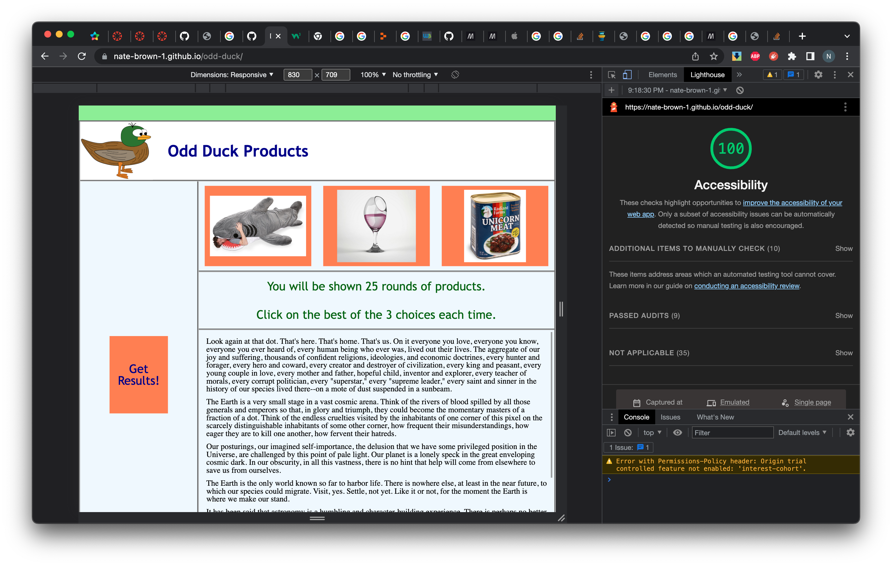

# odd-duck

## About this page

Website with Javascript app that asks user to choose their favorite of 3 randomly chosen products from a set of 19 total. Products do not repeat round to round. Voting goes for 25 rounds. After 25 rounds, results are displayed in a bar graph using the Chart.js external library.

The site uses local storage to retain vote totals, so that when the page is refreshed or reloaded, previous user data persists and is included in displayed vote total bar graph after subsequent rounds are complete.

## Sources

### Chart.js

External library used to make bar chart. Takes data in array form and can be customized with colors and other appearance features.

Library homepage and instructions: url(<https://www.chartjs.org/>)

Runs on page using jsDelivr: url(<https://www.jsdelivr.com/package/npm/chart.js?path=dist>)

### odd-duck.png (header logo image)

- downloaded from url(<https://publicdomainvectors.org/en/free-clipart/Cartoon-young-duck-vector-graphics/34508.html>)
- free, public domain

### Lighthouse screenshot

Accessibility 100. Score remains the same from lab 12 and lab 13.

